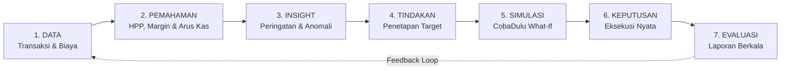
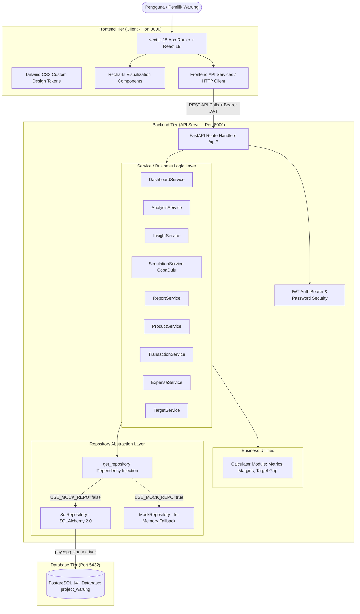
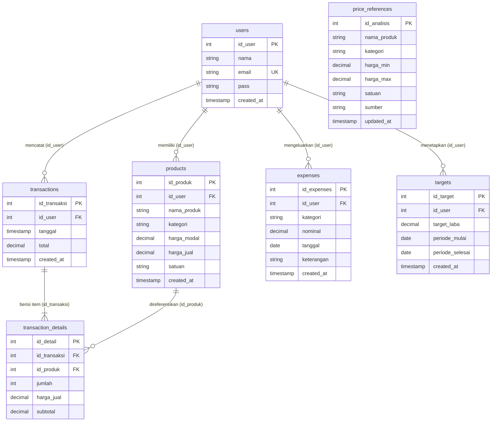

# KedaiKas

Platform digital pendukung keputusan (*decision-support system*) berbasis data transaksi dan keuangan nyata untuk usaha mikro, kecil, dan menengah (warung/UMKM).

KedaiKas dirancang untuk menjembatani kesenjangan antara sekadar mencatat transaksi harian dan memahami langkah strategis yang perlu diambil berikutnya—membantu pemilik usaha bergerak dari pencatatan administratif menuju pengambilan keputusan bisnis yang rasional, terukur, dan berbasis data.

---

## Daftar Isi

- [Latar Belakang & Filosofi](#latar-belakang--filosofi)
- [Konsep Inti: Decision-Support Framework](#konsep-inti-decision-support-framework)
- [Alur Pengguna (User Flow)](#alur-pengguna-user-flow)
- [Fitur & Modul Sistem](#fitur--modul-sistem)
- [Arsitektur Sistem](#arsitektur-sistem)
- [Teknologi yang Digunakan](#teknologi-yang-digunakan)
- [Basis Data & Pemodelan Relasional](#basis-data--pemodelan-relasional)
- [Dataset Demo Pengujian](#dataset-demo-pengujian)
- [Struktur Direktori Repositori](#struktur-direktori-repositori)
- [Panduan Instalasi & Menjalankan Lokal](#panduan-instalasi--menjalankan-lokal)
- [Penyiapan Database PostgreSQL](#penyiapan-database-postgresql)
- [Konfigurasi Environment](#konfigurasi-environment)
- [Daftar Endpoint API (REST API)](#daftar-endpoint-api-rest-api)
- [Autentikasi & Keamanan Data](#autentikasi--keamanan-data)
- [Pengujian (Testing) & Validasi Build](#pengujian-testing--validasi-build)
- [Desain Antarmuka & UX](#desain-antarmuka--ux)
- [Keunggulan Teknis (Technical Highlights)](#keunggulan-teknis-technical-highlights)
- [Status Project Saat Ini](#status-project-saat-ini)
- [Konteks Asal Project](#konteks-asal-project)

---

## Latar Belakang & Filosofi

Sebagian besar pelaku UMKM dan warung tradisional mengelola operasional secara informal: mencatat kas masuk di buku fisik atau sekadar mengandalkan intuisi kasir harian. Kondisi ini melahirkan beberapa permasalahan mendasar:

1. **Ilusi Arus Kas**: Omzet penjualan yang terlihat besar sering disalahartikan sebagai laba bersih, padahal modal belanja bahan baku (HPP) dan beban operasional belum diperhitungkan secara presisi.
2. **Ketiadaan Visibilitas Margin**: Pemilik warung kerap tidak mengetahui produk mana yang menghasilkan keuntungan riil versus produk yang hanya memakan volume perputaran barang dengan margin minim.
3. **Ketidakpastian Penetapan Harga**: Harga jual sering kali dipatok berdasarkan kebiasaan tanpa komparasi sistematis terhadap dinamika harga pasar sekitar.
4. **Resiko Perubahan Tanpa Prediksi**: Mengubah harga jual atau menambah biaya operasional sering dilakukan tanpa perkiraan dampak terhadap pencapaian laba.

KedaiKas dibangun untuk memecahkan kesenjangan tersebut:

> **Bukan sekadar mencatat transaksi, melainkan memahami apa yang harus dilakukan berikutnya.**

### Batasan Sistem (Apa yang Bukan KedaiKas)
Untuk menjaga fokus nilai tambah pada *decision support*, KedaiKas secara tegas **bukanlah**:
- Sekadar aplikasi kasir / POS konvensional
- Sekadar buku kas digital sederhana
- Sekadar kalkulator keuntungan statis
- Bot percakapan (AI chatbot)
- Marketplace / toko online *e-commerce*
- Gerbang pembayaran (*payment gateway*)
- Sistem otomasi perangkat keras / IoT

Nilai utama KedaiKas bertumpu pada **mesin analitik, agregasi metrik, dan simulasi skenario bisnis (*what-if analysis*)** yang bertumpu pada data riil usaha.

---

## Konsep Inti: Decision-Support Framework

KedaiKas mengoperasionalkan rantai nilai analitik bisnis melalui kerangka kerja terpadu:

$$\text{DATA} \longrightarrow \text{PEMAHAMAN} \longrightarrow \text{INSIGHT} \longrightarrow \text{TINDAKAN} \longrightarrow \text{SIMULASI} \longrightarrow \text{KEPUTUSAN} \longrightarrow \text{EVALUASI}$$



---

## Alur Pengguna (User Flow)

Siklus pemanfaatan KedaiKas dalam ritme operasional pemilik usaha:

| Tahap | Aktivitas Pengguna | Hasil dalam Sistem |
|---|---|---|
| **1. CATAT** | Mencatat transaksi penjualan pelanggan dan merekam pengeluaran operasional (listrik, sewa, transportasi, perlengkapan). | Tersimpan sebagai baris data historis terisolasi per akun pemilik usaha. |
| **2. PAHAMI** | Membuka Dashboard eksekutif untuk melihat ringkasan omzet, HPP, laba kotor, beban operasional, laba bersih, dan tren berkala. | Transparansi kondisi riil kesehatan finansial usaha. |
| **3. DAPATKAN INSIGHT** | Memeriksa modul Analisis untuk meninjau efisiensi harga jual terhadap pasar, memetakan produk laris bermargin tipis, dan menerima peringatan lonjakan beban. | Identifikasi risiko dan peluang bisnis secara otomatis tanpa rumus manual. |
| **4. TENTUKAN TARGET** | Memasang sasaran laba bersih nominal untuk periode tertentu (misal: target bulanan). | Sistem menghitung *gap* capaian dan estimasi laba harian yang dibutuhkan. |
| **5. COBADULU** | Memasukkan eksperimen harga jual baru, perkiraan volume penjualan, dan perubahan biaya di modul simulator. | Sistem memproyeksikan laba baru dan mengevaluasi ketercapaian target di memori tanpa memanipulasi data riil. |
| **6. AMBIL KEPUTUSAN** | Memilih skenario terbaik yang dinilai aman dan berpotensi meningkatkan margin, lalu menerapkannya pada operasional nyata. | Penerapan harga katalog baru atau penyesuaian anggaran operasional. |
| **7. EVALUASI** | Membuka modul Laporan dengan filter tanggal untuk membandingkan realisasi performa terhadap proyeksi masa lalu. | Rekapitulasi evaluasi yang dapat dicetak atau disimpan sebagai PDF. |

---

## Fitur & Modul Sistem

Sistem menyediakan 7 modul fungsional utama yang saling terhubung:

### 1. Dashboard Eksekutif
- **Metrik Utama Bisnis**: Kartu ringkasan Omzet, HPP (*Harga Pokok Penjualan*), Laba Kotor, Pengeluaran Operasional, Laba Bersih, dan Margin Bersih.
- **Visualisasi Tren Penjualan & Laba**: Grafik batang interaktif dengan agregasi periodik:
  - **Harian**: Agregasi data transaksi 7 hari operasional terakhir.
  - **Mingguan**: Agregasi transaksi 6 minggu operasional terakhir.
  - **Bulanan**: Agregasi transaksi hingga 12 bulan terakhir.
  - *Catatan Implementasi*: Nilai chart dihitung secara dinamis dari pengelompokan (*bucket grouping*) data transaksi nyata di database, bukan nilai tiruan statis (*mock static values*).
- **Deteksi Puncak Penjualan**: Kalkulasi otomatis periode dengan performa omzet tertinggi beserta perbandingannya terhadap rata-rata periode lain.
- **Monitoring Target Aktif**: Indikator persentase capaian target laba berjalan, sisa gap laba nominal, dan estimasi laba harian yang dibutuhkan.
- **Widget Peringatan & Transaksi Terkini**: Menampilkan peringatan risiko terbaru dan daftar 5 transaksi penjualan terakhir.

### 2. Transaksi Penjualan (Kasir)
- **Pencatatan Penjualan Cepat**: Pemilihan produk langsung dari katalog master warung.
- **Kalkulasi Otomatis**: Perhitungan kuantitas, harga satuan, subtotal per item, dan total transaksi penjualan.
- **Detail Transaksi**: Setiap transaksi tersimpan bersama rincian item produk (`transaction_details`), kuantitas, dan harga jual saat transaksi berlangsung.
- **Riwayat Penjualan**: Rekapitulasi transaksi historis lengkap dengan pencarian dan filter urutan waktu.

### 3. Manajemen Produk
- **Master Data Produk**: Penambahan, pembaruan, dan penghapusan produk dagangan.
- **Struktur Finansial Produk**: Setiap produk wajib memiliki Harga Modal (HPP), Harga Jual, Kategori, dan Satuan penjualan (Pcs, Kg, Botol, Pouch, Pack, dll.).
- **Kalkulasi Margin Otomatis**: Sistem langsung mengalkulasikan persentase margin keuntungan produk:
  $$\text{Margin (\%)} = \frac{\text{Harga Jual} - \text{Harga Modal}}{\text{Harga Jual}} \times 100\%$$
- *Catatan Implementasi*: Sesuai skema database saat ini, modul produk memfokuskan pencatatan pada nilai keekonomian produk (HPP, harga jual, margin, performa penjualan); pelacakan stok kuantitas gudang (*inventory level*) belum menjadi entitas mandiri.

### 4. Manajemen Keuangan & Pengeluaran
- **Pencatatan Arus Kas Keluar**: Dokumentasi beban operasional warung non-HPP (seperti bayar listrik, sewa tempat, bensin transportasi kulakan, kemasan plastik, dan pemeliharaan alat).
- **Kategorisasi Biaya**: Pengelompokan pengeluaran (Operasional, Sewa, Transportasi, Perlengkapan, dll.) beserta tanggal dan catatan keterangan.
- **Visibilitas Beban Riil**: Data pengeluaran menjadi faktor pengurang langsung terhadap Laba Kotor untuk menghasilkan Laba Bersih usaha yang sesungguhnya.

### 5. Analisis & Insight (Core Differentiator)
Modul analitik analitis yang membedakan KedaiKas dari sekadar aplikasi kasir:
- **Analisis Referensi Harga Pasar (`/api/analysis/price-comparison`)**:
  Membandingkan harga jual warung terhadap data acuan pasar (`price_references`):
  - *Di bawah referensi*: Mengidentifikasi peluang menaikkan harga guna memulihkan margin tanpa melampaui harga pasar.
  - *Dalam rentang wajar*: Mengonfirmasi stabilitas daya saing produk.
  - *Di atas referensi*: Memberikan catatan untuk menjaga keunggulan mutu dan layanan.
- **Analisis Kinerja Produk (`/api/analysis/products`)**:
  Mengelompokkan performa penjualan produk secara otomatis:
  1. *Produk Terlaris* (berdasarkan volume unit terjual).
  2. *Produk Omzet Tertinggi* (berdasarkan akumulasi nilai transaksi).
  3. *Produk Margin Tertinggi* (persentase keuntungan terbesar).
  4. *Produk Laris tapi Margin Rendah*: Mendeteksi produk yang memiliki perputaran tinggi namun menyumbang laba tipis per porsi—titik kritis yang sering luput dari perhatian pemilik UMKM.
- **Analisis Komparasi Finansial (`/api/analysis/financial`)**:
  Menghitung persentase perubahan (*growth rate*) antara periode 7 hari terkini terhadap 7 hari sebelumnya untuk metrik omzet, laba bersih, dan pengeluaran.
- **Mesin Insight & Peringatan Otomatis (`/api/analysis/insights`)**:
  Mengevaluasi kondisi usaha melalui aturan logika deterministik (*rule-based business intelligence*):
  - Deteksi lonjakan pengeluaran operasional (>20% peningkatan).
  - Peringatan penurunan laba saat omzet naik (*profit compression* akibat kenaikan HPP/biaya).
  - Peringatan margin tipis pada produk bervolume tinggi.
  - Notifikasi pencapaian pertumbuhan positif.
  - *Catatan*: Insight diproses melalui logika perhitungan analitik terstruktur pada backend Python, bukan chatbot atau generasi teks generatif.

### 6. Target Usaha & Simulator CobaDulu
Menghubungkan penetapan sasaran finansial dengan simulasi skenario bisnis:

- **Target Laba**:
  - Menetapkan sasaran laba bersih dalam rentang tanggal tertentu (`periode_mulai` s.d. `periode_selesai`).
  - Menampilkan evaluasi pencapaian, sisa nominal gap, dan laju laba harian yang dibutuhkan untuk mencapai target.

- **Simulator CobaDulu (`/api/simulation`)**:
  - Wadah analisis skenario *what-if* yang dieksekusi **murni di dalam memori** tanpa memanipulasi atau merusak data pembukuan asli di database.
  - **Variabel yang Dapat Diuji**:
    - Penyesuaian harga jual produk tertentu.
    - Penyesuaian harga modal (HPP) produk.
    - Proyeksi perubahan volume penjualan (kuantitas unit terjual).
    - Proyeksi beban pengeluaran operasional baru.
    - Sasaran target laba alternatif.
  - **Output Simulasi**:
    - Komparasi metrik saat ini vs proyeksi skenario (Omzet, HPP, Laba Kotor, Pengeluaran, Laba Bersih, Margin).
    - Selisih nominal (*variance difference*) tiap komponen finansial.
    - Evaluasi apakah skenario yang diuji **berpotensi** menutup gap target laba atau menghasilkan surplus.
  - *Terminologi Sistem*: KedaiKas menggunakan terminologi kehati-hatian (*proyeksi*, *estimasi*, *berpotensi*, *simulasi*) dan tidak menjamin kepastian hasil bisnis nyata.

### 7. Laporan Bisnis
- **Rekapitulasi Finansial Periodik**: Filter berdasarkan rentang tanggal fleksibel serta jalan pintas filter "Bulan Ini".
- **Ringkasan Angka Utama**: Total transaksi, akumulasi omzet, HPP, laba kotor, total beban operasional, laba bersih, dan margin bersih periode terpilih.
- **Rincian Kontribusi Produk**: Tabel peringkat produk berdasarkan omzet, kuantitas terjual, total laba kotor yang disumbangkan, dan margin masing-masing dalam periode terkait.
- **Ekspor Dokumen**: Tersedia tombol cetak langsung (*print view*) yang dioptimalkan untuk browser print-to-PDF.

---

## Arsitektur Sistem

KedaiKas mengadopsi arsitektur berlapis (*Clean Layered Architecture*) dengan pemisahan tanggung jawab (*separation of concerns*) yang tegas:



### Pemisahan Tanggung Jawab
- **Frontend (Next.js / TypeScript)**:
  Fokus murni pada interaksi antarmuka pengguna, format tampilan mata uang lokal (Rupiah), penyajian grafik visual, dan penanganan status navigasi terproteksi.
- **Backend (FastAPI / Python)**:
  Memusatkan seluruh aturan bisnis (*business rules*), kalkulasi HPP dan laba, validasi schema Pydantic, algoritma deteksi anomali/insight, agregasi periodik, serta komputasi simulasi *what-if*.
- **Repository Layer**:
  Mengisolasi logika manipulasi database. `SqlRepository` mengeksekusi kueri relasional ke PostgreSQL via SQLAlchemy 2.0, sementara `MockRepository` menyediakan opsi berjalan in-memory tanpa dependensi database aktif untuk pengujian lokal terisolasi.
- **Database (PostgreSQL)**:
  Menjamin integritas data relasional, constraint integritas referensial (*foreign key cascade*), serta audit timestamp otomatis melalui trigger.

---

## Teknologi yang Digunakan

### Frontend
| Teknologi | Versi | Peran dalam Sistem |
|---|---|---|
| **Next.js** | 15.1.7 (App Router) | Framework aplikasi React dengan server/client component rendering dan rute terstruktur |
| **TypeScript** | 5.7.3 | Jaminan type-safety pada kontrak data, parameter props, dan respons API |
| **React & React DOM** | 19.0.0 | Pustaka dasar komponen antarmuka pengguna |
| **Tailwind CSS** | 3.4.17 | Styling antarmuka berbasis utility dengan integrasi token desain Google Stitch |
| **Recharts** | 2.15.1 | Pustaka visualisasi grafik batang dan tren telemetri finansial |
| **Lucide React** | 0.475.0 | Ikonografi modern dan konsisten di seluruh modul |

### Backend
| Teknologi | Versi | Peran dalam Sistem |
|---|---|---|
| **FastAPI** | >= 0.110.0 | Framework backend performa tinggi dengan dokumentasi OpenAPI otomatis (Swagger/ReDoc) |
| **Uvicorn** | >= 0.28.0 | ASGI web server untuk menjalankan aplikasi FastAPI |
| **Python** | 3.11+ / 3.13 | Bahasa pemrograman backend untuk kalkulasi finansial presisi (`Decimal`) |
| **SQLAlchemy** | >= 2.0.28 | Object-Relational Mapper (ORM) modern dan abstraction layer kueri SQL |
| **Pydantic & Settings** | >= 2.6.0 | Validasi skema input/output data request dan parsing konfigurasi `.env` |
| **psycopg (psycopg 3 binary)** | >= 3.1.0 | Driver native berkinerja tinggi untuk konektivitas PostgreSQL |
| **PyJWT & Passlib / Bcrypt**| >= 2.8.0 | Penerbitan dan validasi token JWT serta enkripsi hash password satu arah |
| **Pytest & HTTPX** | >= 8.0.0 | Framework pengujian unit dan integrasi endpoint |

### Database
- **Engine Utama**: PostgreSQL (versi 14 hingga 18 didukung)
- **Nama Basis Data**: `project_warung`
- **Aset Skrip**:
  - `database/postgresql_schema.sql` (DDL skema tabel, indeks, dan trigger)
  - `database/postgresql_seed.sql` (DML data awal pengujian)
  - `database/seed_ahmad_demo.sql` (DML data historis demo lengkap)
  - *Catatan Aset Warisan*: Berkas `database/project_warung.sql`, `database/schema.sql`, dan `database/seed.sql` merupakan berkas referensi/fallback dari lingkungan MariaDB/MySQL terdahulu. Sistem utama saat ini diarahkan dan diuji pada PostgreSQL.

---

## Basis Data & Pemodelan Relasional

Skema relasional PostgreSQL KedaiKas dibangun di atas 7 entitas utama dengan relasi integritas referensial:



### Rincian Tabel:
1. **`users`**: Entitas akun pengguna. Kolom: `id_user` (PK, Serial), `nama`, `email` (Unique), `pass`, `created_at`.
2. **`products`**: Katalog master produk milik akun. Kolom: `id_produk` (PK, Serial), `id_user` (FK ke `users.id_user` ON DELETE CASCADE), `nama_produk`, `kategori`, `harga_modal`, `harga_jual`, `satuan`, `created_at`.
3. **`transactions`**: Header transaksi penjualan kasir. Kolom: `id_transaksi` (PK, Serial), `id_user` (FK ke `users.id_user` ON DELETE CASCADE), `tanggal`, `total`, `created_at`.
4. **`transaction_details`**: Rincian item produk dalam tiap transaksi. Kolom: `id_detail` (PK, Serial), `id_transaksi` (FK ke `transactions.id_transaksi` ON DELETE CASCADE), `id_produk` (FK ke `products.id_produk` ON DELETE CASCADE), `jumlah`, `harga_jual`, `subtotal`.
5. **`expenses`**: Pengeluaran operasional warung non-HPP. Kolom: `id_expenses` (PK, Serial), `id_user` (FK ke `users.id_user` ON DELETE CASCADE), `kategori`, `nominal`, `tanggal`, `keterangan`, `created_at`.
6. **`targets`**: Target laba bersih berkala. Kolom: `id_target` (PK, Serial), `id_user` (FK ke `users.id_user` ON DELETE CASCADE), `target_laba`, `periode_mulai`, `periode_selesai`, `created_at`.
7. **`price_references`**: Tolok ukur (*benchmark*) rentang harga pasar sekitar untuk modul analisis harga. Kolom: `id_analisis` (PK, Serial), `nama_produk`, `kategori`, `harga_min`, `harga_max`, `satuan`, `sumber`, `updated_at` (dilengkapi trigger otomatis `trg_price_references_updated_at`).

---

## Dataset Demo Pengujian

Untuk mempermudah eksplorasi lokal, pengujian modul analitik, dan presentasi fungsionalitas visual tanpa harus menginput puluhan data secara manual, repositori menyediakan dua tingkatan dataset:

### 1. Base Seed (`database/postgresql_seed.sql`)
- 3 akun pengguna (`Ahmad Khairul`, `Daffa Berlliano`, `Darin Hilmi`)
- 4 produk dasar
- 12 transaksi penjualan
- 22 rincian item transaksi
- 4 pengeluaran operasional
- 2 target usaha
- 11 data referensi harga pasar (`price_references`)

### 2. Enriched Demo Dataset (`database/seed_ahmad_demo.sql`)
Dataset terkayakan khusus untuk akun `Ahmad Khairul Fatih` (`id_user = 1`):
- **31 produk** aktif di bawah akun Ahmad Khairul (dari total 33 produk di tabel) mencakup 6 kategori UMKM: *Makanan Ringan*, *Makanan*, *Minuman*, *Sembako*, *Rumah Tangga*, dan *Perlengkapan*.
- **54 transaksi penjualan historis** untuk akun Ahmad Khairul (dari total 56 transaksi di tabel) yang terdistribusi realistis sepanjang rentang waktu **Juli, Agustus, hingga September 2026**.
- **243 baris item detail transaksi** yang mencerminkan pola belanja pelanggan warung sebenarnya.
- **24 catatan pengeluaran operasional** (listrik warung, sewa kios, bensin transportasi kulakan, kemasan plastik, galon air, dsb.) sepanjang Juli–September 2026.
- **4 target laba** periodik bulanan.
- *Karakteristik Skrip*: Bersifat **idempoten** (`ON CONFLICT DO NOTHING`) dan secara otomatis menyinkronkan sequence serial (`setval`) sehingga aman dijalankan berulang kali.

Dataset ini bertujuan agar grafik telemetri Dashboard (Harian, Mingguan, Bulanan), mesin insight, komparasi finansial 7 hari, dan simulator CobaDulu dapat langsung didemonstrasikan dengan data yang hidup dan masuk akal.

---

## Struktur Direktori Repositori

```text
umkm-decision-support/
├── README.md                           # Dokumentasi komprehensif repositori proyek
├── START PROJECT.bat                   # Batch script otomatis untuk menjalankan backend & frontend (Windows)
├── docker-compose.yml                  # Konfigurasi container service opsional
├── download_stitch.py                  # Skrip utilitas pengunduh aset desain
│
├── frontend/                           # Aplikasi Web Client (Next.js 15 + TypeScript)
│   ├── public/                         # Aset publik statis (logo brand SVG, avatar, favicon)
│   ├── src/
│   │   ├── app/                        # Direktori rute Next.js App Router (14 rute terkompilasi)
│   │   │   ├── layout.tsx              # Root HTML layout, font setup, dan metadata aplikasi
│   │   │   ├── globals.css             # Utility Tailwind dan variabel warna CSS custom
│   │   │   ├── page.tsx                # Halaman landing / proteksi pengalihan
│   │   │   ├── login/page.tsx          # Halaman autentikasi masuk
│   │   │   ├── register/page.tsx       # Halaman pendaftaran akun baru
│   │   │   └── dashboard/              # Halaman antarmuka terproteksi
│   │   │       ├── layout.tsx          # Layout bersama dashboard (Sidebar navigasi, Header, User Menu)
│   │   │       ├── page.tsx            # Dashboard Eksekutif (Metrik, Chart Recharts, Insight, Target)
│   │   │       ├── transaksi/page.tsx  # Kasir penjualan dan riwayat transaksi
│   │   │       ├── produk/page.tsx     # Manajemen katalog produk dan kalkulasi margin
│   │   │       ├── keuangan/page.tsx   # Pencatatan biaya operasional dan arus kas keluar
│   │   │       ├── analisis/page.tsx   # Modul BI: Benchmark harga pasar, performa produk, margin tipis
│   │   │       ├── target/page.tsx     # Penetapan target laba dan pemantauan gap capaian
│   │   │       ├── cobadulu/page.tsx   # Simulator keputusan skenario bisnis (what-if analysis)
│   │   │       └── laporan/page.tsx    # Rekapitulasi laporan periodik dan view Cetak/PDF
│   │   ├── lib/                        # Utilitas format mata uang Rupiah, tanggal, dan persentase
│   │   ├── services/                   # Abstraksi klien HTTP API (auth, dashboard, transaksi, analisis, dll.)
│   │   └── types/                      # Deklarasi antarmuka dan tipe data TypeScript
│   ├── tailwind.config.js              # Konfigurasi token warna Stitch, radius, dan tipografi
│   ├── tsconfig.json                   # Konfigurasi compiler TypeScript
│   ├── .env.local.example              # Template variabel lingkungan frontend
│   └── package.json                    # Dependensi frontend dan skrip build
│
├── backend/                            # Aplikasi REST API Server (FastAPI + Python)
│   ├── app/
│   │   ├── main.py                     # Entry point FastAPI, CORS middleware, global exception handler
│   │   ├── api/
│   │   │   ├── router.py               # Agregator rute modular di bawah prefix /api
│   │   │   └── routes/                 # Modul endpoint: auth, products, transactions, analysis, dll.
│   │   ├── core/                       # Pengaturan konfigurasi Settings, database connection, dan security
│   │   ├── models/                     # Deklarasi model relasional SQLAlchemy 2.0
│   │   ├── schemas/                    # Skema Pydantic v2 untuk validasi request dan respons JSON
│   │   ├── repositories/               # Abstraksi data layer (SqlRepository dan MockRepository)
│   │   ├── services/                   # Layanan logika bisnis murni, analisis, kalkulator, dan simulasi
│   │   └── utils/                      # Fungsi pembantu: kalkulator keuangan, margin, dan formatter
│   ├── tests/                          # Automated unit dan integration tests (Pytest)
│   ├── requirements.txt                # Dependensi pustaka Python
│   ├── pytest.ini                      # Konfigurasi eksekusi pengujian Pytest
│   └── .env.example                    # Template variabel lingkungan backend
│
├── database/                           # Skrip skema DDL dan data pengujian DML
│   ├── postgresql_schema.sql           # Skema tabel, foreign key, dan trigger PostgreSQL
│   ├── postgresql_seed.sql             # Data awal dasar (base seed) PostgreSQL
│   ├── seed_ahmad_demo.sql             # Dataset pengujian demo historis (30+ produk, transaksi Juli–Sept 2026)
│   ├── project_warung.sql              # Dump referensi/warisan MariaDB terdahulu
│   ├── schema.sql                      # Skema kompatibilitas MySQL terdahulu
│   └── seed.sql                        # Seed data kompatibilitas MySQL terdahulu
│
├── .stitch/                            # Referensi sistem desain dan aset Google Stitch
│   ├── DESIGN.md                       # Dokumentasi spesifikasi warna, tipografi, dan gaya antarmuka
│   ├── *.html                          # Mockup HTML hasil rancangan antarmuka
│   └── *.png                           # Screenshot visual tiap layar
│
└── docs/                               # Dokumentasi pendukung proyek (API, ERD, Flowchart)
```

---

## Panduan Instalasi & Menjalankan Lokal

Panduan berikut mengasumsikan lingkungan pengembangan pada sistem operasi **Windows**.

### Prasyarat Sistem
- **Python**: Versi 3.11 atau lebih baru terpasang di PATH
- **Node.js**: Versi 18 atau 20+ LTS terpasang di PATH
- **PostgreSQL**: Layanan PostgreSQL 14+ berjalan lokal (default port: `5432`)
- **Git**: Terpasang untuk kloning repositori

---

### Langkah 1: Kloning Repositori
Buka PowerShell atau Command Prompt:
```bash
git clone https://github.com/kha1de/KedaiKas.git
cd KedaiKas
```

---

### Langkah 2: Setup Database PostgreSQL

1. Pastikan server PostgreSQL aktif di komputer Anda.
2. Buat database baru bernama `project_warung`:
   ```bash
   createdb -U postgres project_warung
   ```
   *(Atau buat melalui pgAdmin / shell `psql`)*

3. Terapkan berkas skema dan data benih secara berurutan:
   ```bash
   # 1. Eksekusi skema tabel, indeks, dan trigger
   psql -U postgres -d project_warung -f database/postgresql_schema.sql

   # 2. Eksekusi data dasar (Base Seed)
   psql -U postgres -d project_warung -f database/postgresql_seed.sql

   # 3. (Sangat Direkomendasikan) Eksekusi data demo historis Ahmad Khairul
   psql -U postgres -d project_warung -f database/seed_ahmad_demo.sql
   ```

---

### Langkah 3: Setup Backend (FastAPI)

1. Masuk ke direktori `backend`:
   ```bash
   cd backend
   ```

2. Buat virtual environment Python dan aktifkan:
   ```bash
   python -m venv venv
   .\venv\Scripts\activate
   ```

3. Pasang seluruh dependensi pustaka:
   ```bash
   pip install -r requirements.txt
   ```

4. Buat file konfigurasi `.env` dari template:
   ```bash
   copy .env.example .env
   ```

5. Buka `backend/.env` dan sesuaikan kredensial koneksi database:
   ```env
   PROJECT_NAME="KedaiKas"
   SECRET_KEY="ganti-dengan-string-rahasia-minimal-32-karakter-acak"
   
   # Format URL koneksi PostgreSQL via psycopg:
   DATABASE_URL="postgresql+psycopg://postgres:<PASSWORD_POSTGRES_ANDA>@localhost:5432/project_warung"
   
   # Atur ke false untuk menggunakan koneksi PostgreSQL nyata:
   USE_MOCK_REPO=false
   ```

6. Jalankan server FastAPI backend:
   ```bash
   python -m uvicorn app.main:app --reload --port 8000
   ```
   - API Backend aktif pada: `http://localhost:8000`
   - Dokumentasi Interaktif Swagger UI: `http://localhost:8000/docs`
   - Dokumentasi Interaktif ReDoc: `http://localhost:8000/redoc`

---

### Langkah 4: Setup Frontend (Next.js)

Buka terminal kedua (PowerShell terpisah) dari root repositori:

1. Masuk ke direktori `frontend`:
   ```bash
   cd frontend
   ```

2. Buat file konfigurasi `.env.local` dari template:
   ```bash
   copy .env.local.example .env.local
   ```
   *Pastikan isinya mengarah ke API Backend:*
   ```env
   NEXT_PUBLIC_API_URL=http://localhost:8000/api
   ```

3. Pasang paket dependensi Node:
   ```bash
   npm install
   ```

4. Jalankan development server Next.js:
   ```bash
   npm run dev
   ```
   *(Pada sistem Windows yang membatasi eksekusi PowerShell script, gunakan `npm.cmd run dev`)*

5. Buka browser dan akses aplikasi:
   ```text
   http://localhost:3000
   ```

> [!NOTE]
> Proyek membutuhkan backend (port 8000) dan frontend (port 3000) berjalan secara simultan di dua terminal berbeda agar sistem dapat bertukar data melalui REST API.

---

### Opsi Praktis: Menjalankan Sekaligus via Batch Script
Pada sistem Windows, Anda dapat menjalankan backend dan frontend sekaligus hanya dengan mengklik ganda file root:
```cmd
"START PROJECT.bat"
```
Skrip ini akan secara otomatis membuka jendela terminal Backend FastAPI, jendela terminal Frontend Next.js, dan meluncurkan browser ke `http://localhost:3000`.

---

## Konfigurasi Environment

### Backend (`backend/.env`)
| Variabel | Tipe | Contoh / Keterangan |
|---|---|---|
| `PROJECT_NAME` | String | Nama aplikasi (`KedaiKas`) |
| `SECRET_KEY` | String | Kunci rahasia hashing token JWT (gunakan minimal 32 karakter unik) |
| `DATABASE_URL` | String | Format: `postgresql+psycopg://<user>:<password>@<host>:<port>/<dbname>` |
| `USE_MOCK_REPO` | Boolean | `false` untuk database PostgreSQL aktif; `true` untuk mode in-memory mandiri |

### Frontend (`frontend/.env.local`)
| Variabel | Tipe | Contoh / Keterangan |
|---|---|---|
| `NEXT_PUBLIC_API_URL` | String | URL basis endpoint API backend: `http://localhost:8000/api` |

> [!IMPORTANT]
> Jangan pernah melakukan commit file `.env` atau `.env.local` yang memuat password atau JWT secret asli ke repositori publik. Seluruh berkas konfigurasi lokal tersebut telah dikecualikan oleh `.gitignore`.

---

## Daftar Endpoint API (REST API)

Seluruh endpoint layanan dikelompokkan di bawah prefix `/api`:

| Modul | Method | URL Endpoint | Deskripsi Operasi |
|---|---|---|---|
| **System** | `GET` | `/` | Status ketersediaan server dan mode repositori yang aktif |
| **System** | `GET` | `/api/health` | Health check probe status server (`mock` / `sql`) |
| **Auth** | `POST` | `/api/auth/register` | Pendaftaran akun baru pemilik warung |
| **Auth** | `POST` | `/api/auth/login` | Autentikasi akun dan penerbitan Bearer JWT Token |
| **Auth** | `GET` | `/api/auth/me` | Mengambil data profil pengguna aktif dari token JWT |
| **Dashboard** | `GET` | `/api/dashboard` | Agregasi metrik eksekutif (omzet, HPP, laba bersih, progress target) |
| **Products** | `GET` | `/api/products` | Mendapatkan seluruh katalog produk pengguna |
| **Products** | `POST` | `/api/products` | Menambahkan produk baru (nama, kategori, HPP, harga jual, satuan) |
| **Products** | `GET` | `/api/products/{id}` | Mengambil data satu produk spesifik |
| **Products** | `PUT` | `/api/products/{id}` | Memperbarui informasi produk atau penyesuaian harga |
| **Products** | `DELETE` | `/api/products/{id}` | Menghapus produk dari katalog |
| **Transactions** | `GET` | `/api/transactions` | Mengambil seluruh riwayat transaksi penjualan beserta rincian item |
| **Transactions** | `POST` | `/api/transactions` | Menyimpan transaksi baru kasir lengkap beserta item yang dibeli |
| **Transactions** | `GET` | `/api/transactions/{id}`| Mengambil satu nota transaksi spesifik beserta rincian item |
| **Expenses** | `GET` | `/api/expenses` | Mengambil daftar pengeluaran operasional warung |
| **Expenses** | `POST` | `/api/expenses` | Mencatat beban pengeluaran baru (kategori, nominal, tanggal, keterangan) |
| **Expenses** | `DELETE` | `/api/expenses/{id}` | Menghapus baris pencatatan beban operasional |
| **Analysis** | `GET` | `/api/analysis/price-comparison` | Komparasi harga jual produk terhadap rentang referensi pasar |
| **Analysis** | `GET` | `/api/analysis/products` | Analisis produk terlaris, omzet tertinggi, margin tinggi, dan margin tipis |
| **Analysis** | `GET` | `/api/analysis/financial` | Komparasi tren pertumbuhan finansial 7 hari terkini vs 7 hari lalu |
| **Analysis** | `GET` | `/api/analysis/insights` | Peringatan otomatis, deteksi lonjakan biaya, dan insight bisnis |
| **Targets** | `GET` | `/api/targets` | Mengambil riwayat penetapan target laba pengguna |
| **Targets** | `POST` | `/api/targets` | Menetapkan target laba bersih dan rentang tanggal baru |
| **Targets** | `GET` | `/api/targets/current` | Mengambil target laba yang sedang aktif saat ini |
| **Simulation** | `POST` | `/api/simulation` | Menjalankan simulasi skenario bisnis *CobaDulu* (non-mutatif di memori) |
| **Reports** | `GET` | `/api/reports` | Rekapitulasi laporan performa usaha dengan filter tanggal mulai/selesai |

---

## Autentikasi & Keamanan Data

- **Token-Based Authentication**: Menggunakan standar industri **JSON Web Token (JWT)** dengan algoritma enkripsi tanda tangan digital `HS256`.
- **Isolasi Data Tingkat Akun**:
  Seluruh data operasional (produk, transaksi, rincian nota, beban pengeluaran, target) terikat ketat dengan `id_user` dari token JWT yang terverifikasi. Pengguna tidak memiliki akses terhadap pembukuan akun usaha lain.
- **Keamanan Password**:
  Password akun baru di-hash satu arah menggunakan algoritma `bcrypt` dengan salt dinamis. Modul `backend/app/core/security.py` dilengkapi logika verifikasi bertingkat untuk mendukung kompatibilitas akun pada data bawaan seed tanpa mengurangi standar keamanan registrasi akun baru.

---

## Pengujian (Testing) & Validasi Build

### 1. Pengujian Otomatis Backend (Pytest)
Repositori backend menyertakan berkas pengujian otomatis menggunakan **Pytest** untuk memvalidasi logika inti:
- **Cakupan Pengujian**:
  - `test_financial_calc.py`: Logika formulasi metrik finansial, HPP, margin kotor/bersih, dan perhitungan progres target laba.
  - `test_simulation.py`: Verifikasi bahwa simulator *CobaDulu* murni memproyeksikan skenario di memori tanpa memutasi (*non-mutating*) data asli di repository.
  - `test_analysis.py`: Verifikasi algoritma komparasi benchmark harga pasar, deteksi produk margin tipis, dan pembentukan peringatan (*insights & warnings*).
  - `test_products.py` & `test_transactions.py`: Perhitungan margin dan kalkulasi subtotal transaksi.
  - `test_sql_repository.py`: Verifikasi pemetaan kolom dan skema tabel SQLAlchemy terhadap database relasional.
  - `test_auth.py`: Pengujian endpoint login dan proteksi token.

Untuk menjalankan pengujian backend:
```bash
cd backend
python -m pytest tests -v
```

> [!NOTE]
> Rangkaian pengujian saat ini berjumlah **21 test cases** yang berfokus pada verifikasi logika komputasi internal, pemetaan relasional, dan invariansi non-mutasi simulator. Karena sebagian test fixture dirancang untuk kondisi in-memory awal tertentu, pengujian ini berfungsi sebagai alat bantu pengembang (*developer verification suite*) dan bukan merupakan representasi cakupan CI/CD produksi 100%.

### 2. Validasi Build Frontend (Next.js)
Kompilasi TypeScript dan bundel produksi Next.js dapat divalidasi dengan menjalankan:
```bash
cd frontend
npm run build
```
*(atau `npm.cmd run build` pada lingkungan PowerShell)*

Hasil kompilasi produksi:
```text
✓ Compiled successfully
✓ Linting and checking validity of types passed
✓ Generating static pages (14/14)
✓ Finalizing page optimization completed (Exit code 0)
```
Seluruh 14 rute halaman (termasuk halaman publik, autentikasi, dan modul-modul dashboard) lolos validasi tipe data TypeScript tanpa error.

---

## Desain Antarmuka & UX

Antarmuka KedaiKas dirancang dengan filosofi **Warm SaaS & Local-Commerce**:
- **Pendekatan Aksesibel**: Menghindari istilah akuntansi rumit (seperti debit/kredit, jurnal penutup) dan menggantinya dengan terminologi yang ramah dan langsung dipahami oleh pemilik warung (Omzet, Modal Beli/HPP, Pengeluaran Toko, Laba Bersih).
- **Hierarki Visual Berbasis Data**: Informasi disajikan dalam kartu ringkasan eksekutif yang menonjolkan angka nominal penting, dilengkapi indikator persentase perubahan dan status visual.
- **Palet Warna Karakteristik UMKM**:
  - *Warm Cream Canvas* (`#FBF9F5`): Latar belakang nyaman untuk penggunaan kasir berjam-jam.
  - *Forest Green Primary* (`#1B4332`): Menunjukkan stabilitas finansial, keteguhan, dan pertumbuhan usaha.
  - *Sage Green Secondary* (`#40916C`): Aksen penunjang untuk badge positif dan navigasi aktif.
  - *Terracotta Accent* (`#C85A32`): Sentuhan identitas lokal pada elemen aksi dan identitas visual.
- **Tipografi Terstruktur**: Menggunakan font sans-serif modern (*Plus Jakarta Sans*) untuk keterbacaan angka nominal yang tinggi.
- **Referensi Desain**: Spesifikasi rancangan antarmuka awal dieksplorasi melalui **Google Stitch** yang tersimpan pada direktori `.stitch/` sebagai dokumentasi referensi desain.

---

## Keunggulan Teknis (Technical Highlights)

Proyek ini mendemonstrasikan penerapan praktik rekayasa perangkat lunak modern:

1. **Clean Separation of Concerns**: Pemisahan tegas antara antarmuka reaktif (Next.js) dan mesin pemrosesan bisnis (FastAPI).
2. **RESTful Architecture & Typed Contracts**: Kontrak pertukaran data yang ketat menggunakan skema Pydantic v2 di backend dan TypeScript interface di frontend.
3. **Service-Oriented Business Logic**: Logika kalkulasi bisnis, analisis perbandingan, dan skenario simulasi dipisahkan ke dalam *service layer* mandiri, bukan ditumpuk di dalam route handler.
4. **Repository Pattern with Fallback**: Abstraksi data layer yang memungkinkan pengalihan instan antara PostgreSQL nyata (`SqlRepository`) dan mode in-memory terisolasi (`MockRepository`) melalui environment variable.
5. **Relational Integrity in PostgreSQL**: Pemanfaatan *foreign key constraints* dengan aksi `CASCADE`, pembuatan indeks pada kolom foreign key untuk kecepatan query, serta trigger fungsi otomatis untuk pembaruan timestamp.
6. **Stateless JWT Security**: Sistem autentikasi stateless dengan isolasi data antar pengguna yang aman.
7. **Pure In-Memory Simulation Engine**: Mesin CobaDulu menjamin simulasi *what-if* berjalan cepat dan aman tanpa meninggalkan residu atau mengubah data pembukuan asli toko.
8. **Dynamic Transaction-Derived Telemetry**: Visualisasi data chart tidak mengandalkan angka tiruan, melainkan dikompilasi secara dinamis dari agregasi tanggal dan subtotal transaksi aktual.

---

## Status Project Saat Ini

KedaiKas saat ini berada pada tahap **functional local development & portfolio project**:
- Seluruh arsitektur frontend (Next.js 15) dan backend (FastAPI) telah terintegrasi secara penuh.
- Integrasi basis data PostgreSQL telah aktif dengan skema relasional, data awal (base seed), dan dataset demo pengujian terkayakan (Juli–September 2026).
- Seluruh modul fungsional (Dashboard, Transaksi, Produk, Keuangan, Analisis & Insight, Target Laba, Simulator CobaDulu, dan Laporan) telah selesai diimplementasikan.
- Rangkaian pengujian unit backend dan kompilasi build produksi frontend (14 rute statis) berhasil dieksekusi.

> [!NOTE]
> Project ini dikembangkan dan dikelola sebagai lingkungan pengembangan lokal (*local development / portfolio showcase*). Repositori ini tidak mengklaim deployment cloud aktif berskala enterprise, infrastruktur terdistribusi, atau integrasi model AI/ML generatif.

---

## Konteks Asal Project

KedaiKas pada awalnya dikembangkan sebagai proyek kompetisi pengembangan perangkat lunak (*software development competition*) yang mengangkat tema:

> **"Ekosistem Digital untuk Masa Depan Indonesia yang Inklusif dan Berkelanjutan"**

Tema tersebut diterjemahkan ke dalam solusi nyata: memberdayakan ekosistem usaha warung dan UMKM tradisional Indonesia melalui digitalisasi pencatatan yang inklusif, mudah diakses, dan memberikan kapasitas analitik mandiri agar usaha kecil dapat tumbuh secara berkelanjutan.

---

## Lisensi & Kontributor

- **Pengembang**: Ahmad Khairul Fatih & Tim Pengembang KedaiKas
- **Lisensi**: Proyek ini bersifat terbuka untuk tujuan pembelajaran, portofolio rekayasa perangkat lunak, dan pengembangan ekosistem digital UMKM.
